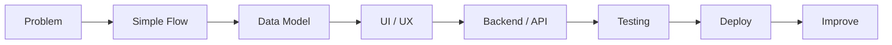

<h1 align="center">Digital Ninja</h1>

<p align="center">
  Practical software builder focused on web applications, automation, dashboards, and AI-assisted development.
</p>

<p align="center">
  <a href="https://github.com/digitalninjanv?tab=repositories">
    
  </a>
  
  <a href="https://github.com/digitalninjanv">
    
  </a>
</p>

---

## About

I build practical digital products with a focus on clarity, usability, and maintainable implementation.

My work usually sits around full-stack web apps, business tools, automation workflows, dashboards, AI integration, and Linux-based development environments. I prefer building systems that solve a real workflow problem rather than adding unnecessary complexity.

```txt
Focus       : Web apps, automation, dashboards, AI tools, business systems
Workflow    : Linux, GitHub, API integration, deployment-oriented development
Approach    : Simple UX, clean structure, secure defaults, practical iteration
Direction   : Useful products that can be tested, improved, and shipped
````

---

## Current Work Direction

| Area             | Practical Focus                                                         |
| ---------------- | ----------------------------------------------------------------------- |
| Web Applications | Responsive interfaces, dashboards, admin panels, user flows             |
| Backend & API    | REST endpoints, database logic, auth, role-based access                 |
| Automation       | Repetitive workflow reduction using scripts, APIs, and AI assistance    |
| AI Tools         | Prompt-driven utilities, assistant workflows, structured output systems |
| Business Systems | POS, finance tools, local marketplace concepts, reporting tools         |
| Linux Workflow   | Development setup, troubleshooting, CLI tools, deployment workflow      |

---

## Technical Stack

<p>
  
</p>

| Layer           | Tools / Technologies                                    |
| --------------- | ------------------------------------------------------- |
| Frontend        | React, Next.js, TypeScript, Tailwind CSS                |
| Backend         | Node.js, PHP, REST API, serverless functions            |
| Database        | PostgreSQL, MySQL, Firebase, Supabase                   |
| Mobile / Native | Kotlin, Android app development basics                  |
| Deployment      | Vercel, Netlify, Cloudflare, Firebase Hosting           |
| Workflow        | Fedora Linux, Git, GitHub, Bash, Docker                 |
| AI Integration  | Gemini API, prompt engineering, AI-assisted development |

---

## How I Build



I try to keep every project understandable from the first read:

* clear purpose
* simple user flow
* maintainable file structure
* readable code
* practical deployment path
* security basics from the beginning
* documentation that explains how to run and improve the project

---

## Public Repository Overview

<p align="center">
  <a href="https://github.com/digitalninjanv?tab=repositories">
    
  </a>
</p>

<p align="center">
  <a href="https://github.com/digitalninjanv?tab=repositories">
    
  </a>
</p>

<p align="center">
  
</p>

<p align="center">
  
</p>

---

## Repository Themes

Most of my public repositories are experiments, tools, templates, or product concepts around:

```txt
business applications
local marketplace systems
finance and transaction tools
Android POS / cashier apps
AI-assisted utilities
dashboard and admin systems
PHP / TypeScript web projects
automation and developer workflow
```

For the latest projects, see the repository list:

<p>
  <a href="https://github.com/digitalninjanv?tab=repositories">
    
  </a>
</p>

---

## Development Principles

| Principle          | Meaning                                                    |
| ------------------ | ---------------------------------------------------------- |
| Practical first    | Build for real use cases, not only visual demos            |
| Readable structure | Code and folders should be easy to understand              |
| Mobile-aware       | Interfaces should work well on small screens               |
| Secure by default  | Validate input, protect secrets, use proper access control |
| Deployment-ready   | Projects should have a clear path to run and publish       |
| Iterative          | Start useful, then improve based on testing and feedback   |

---

## Contact

<p>
  <a href="mailto:sbisa054@gmail.com">
    
  </a>
  <a href="https://github.com/digitalninjanv">
    
  </a>
</p>

---

<p align="center">
  Clean software. Practical systems. Continuous improvement.
</p>
```
