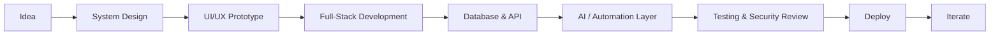
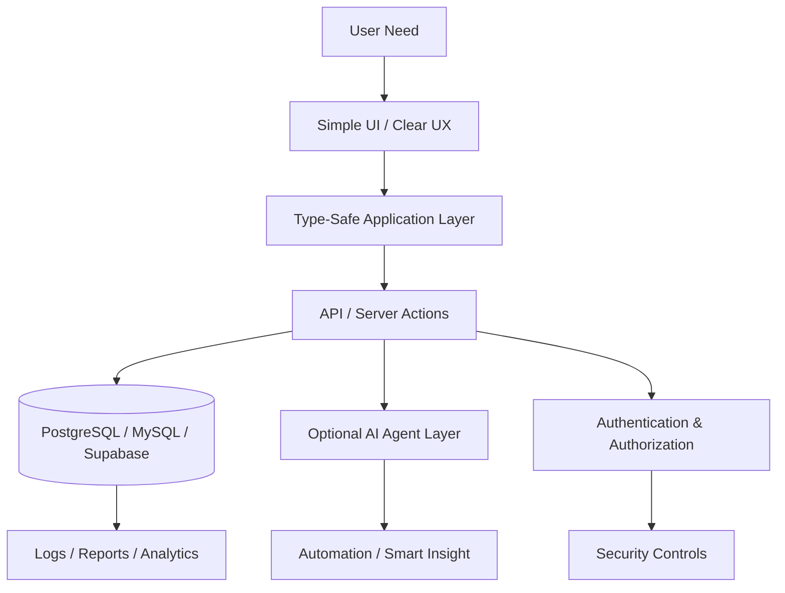

<div align="center">


<br />
<br />


</div>

---

## Identity

I am **Digital Ninja**, a builder focused on creating modern, practical, and scalable software products with an AI-first mindset.

My work combines **full-stack development, automation, clean UI/UX, Linux workflow, API integration, and security-aware engineering**. I prefer building systems that are not only visually modern, but also fast, maintainable, and ready for real users.

```txt
Role        : AI Builder / Full-Stack Developer / Automation Engineer
Focus       : Web apps, SaaS systems, AI tools, dashboards, backend APIs
Mindset     : Fast execution, clean architecture, secure-by-default, scalable design
Workflow    : Linux + GitHub + AI-assisted development + production-oriented iteration
```

---

## Adaptive Profile Layer

This README uses GitHub-safe dynamic components. It updates visually based on live GitHub data without custom JavaScript.

| Dynamic Layer | Behavior |
|---|---|
| **Typing SVG** | Animated headline that makes the profile feel alive. |
| **GitHub Stats** | Auto-updates based on public GitHub activity. |
| **Top Languages** | Auto-adjusts when repository language usage changes. |
| **Activity Graph** | Shows contribution movement over time. |
| **Badges** | Dynamic profile views, followers, and stars. |
| **Architecture Blocks** | Clean visual explanation of the developer direction. |

> GitHub README cannot run custom JavaScript. Dynamic behavior here is implemented through safe SVG, badge, stat cards, and external image renderers supported by Markdown.

---

## Tech Direction 2026

<div align="center">


</div>

| Area | Stack / Tools |
|---|---|
| Frontend | React, Next.js, TypeScript, Tailwind CSS, ShadCN-style UI |
| Backend | Node.js, PHP, REST API, serverless function, database-driven apps |
| Database | PostgreSQL, Supabase, MySQL, Firebase ecosystem |
| AI Integration | Gemini API, AI assistants, automation workflow, prompt engineering |
| Deployment | Vercel, Cloudflare, Firebase Hosting, Netlify |
| DevOps | GitHub, Linux, Docker, Bash, CI-ready workflow |
| Security Mindset | Input validation, auth, RLS, least privilege, audit-friendly design |

---

## What I Build



### Main Product Categories

- **AI-powered web applications** with practical automation.
- **Dashboard systems** for analytics, reporting, and operations.
- **SaaS-style platforms** with login, database, roles, and admin panels.
- **Payment-aware systems** such as QRIS-ready transaction flow concepts.
- **Survey, escrow, business, and productivity tools** designed for real use cases.
- **Linux/developer workflow optimization** for efficient coding and deployment.

---

## Architecture Philosophy



I prefer systems with these principles:

- **Mobile-first and responsive** from the beginning.
- **Database schema-first** so the system is easier to maintain.
- **API-first** for future mobile app or third-party integration.
- **Security-first** using validation, authentication, authorization, and safe environment variables.
- **AI-ready** without making the core system dependent on AI.
- **Deployment-ready** with clear environment configuration.

---

## GitHub Intelligence

<div align="center">


<br />
<br />


<br />
<br />


</div>

---

## Achievement Signal

<div align="center">


</div>

---

## Current Focus

| Focus | Target |
|---|---|
| AI-assisted development | Build faster with structured prompts, clean workflow, and controlled context. |
| Full-stack products | Create web apps with dashboard, auth, database, and deployment flow. |
| Automation | Reduce repetitive work with scripts, APIs, and AI agents. |
| Security baseline | Keep apps safer with validation, permissions, and data isolation. |
| Business systems | Build products that can become real SaaS or operational tools. |

---

## Featured Engineering Style

```txt
1. Understand the business problem
2. Design the data model
3. Build clean UI flow
4. Implement backend/API safely
5. Add analytics and reporting
6. Test edge cases
7. Deploy with environment separation
8. Iterate from real feedback
```

The goal is not just writing code. The goal is shipping a usable system.

---

## Contact

<div align="center">

<a href="mailto:nm6201160@gmail.com">
  
</a>
<a href="https://github.com/digitalninjanv">
  
</a>

</div>

---

<div align="center">


**Building modern, useful, AI-ready systems — one clean iteration at a time.**

</div>
